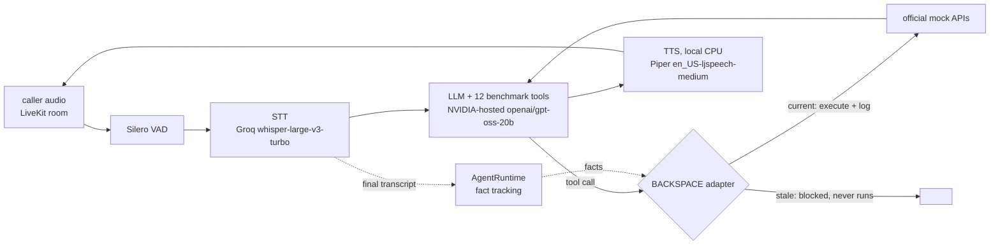
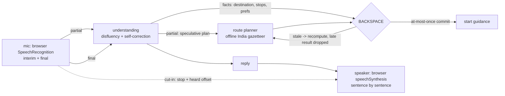

# Interject

**An agent you are meant to talk over.**

Built for **Theme 05 - Interruptible Real-Time Agents**, Samsung PRISM Y2026 GenAI
Hackathon (3rd Edition).

[](https://github.com/joannamariyajames/interject/actions/workflows/ci.yml)
[](LICENSE)


Most assistants take turns: listen, think, speak. Interrupt one and it either
goes silent while it reasons, or throws the whole turn away and starts again.
Interject does neither. It starts retrieving before you stop typing, it stops
mid-word the instant you cut in, and it keeps what it had already worked out so
the next thing you say continues the answer instead of restarting it.

---

## What it does

| Brief says | What is actually implemented |
| --- | --- |
| Full duplex: begin retrieving before the utterance ends | Partial text streams to the server on every keystroke. A debounced speculative retrieval starts on the prefix, and the turn reuses it if the guess still matches when you hit enter. Hit/miss and milliseconds saved are shown live. |
| Handle and recover from real-time interruptions | A turn is one cancellable `asyncio.Task`. A barge-in cancels it and records a **checkpoint**: the partial answer, the retrieved passages, and how far the plan got. Measured time-to-yield is typically **under 1 ms**. |
| Keep the conversation alive without losing logical depth | The checkpoint is reused, not replayed. "go on" resumes from the exact words it stopped on and skips retrieval entirely. |
| Cater to goal changes without losing session context | A goal **stack**, not a variable. A swerve *parks* the old goal instead of dropping it, carrying its accumulated constraints, so "anyway, back to the flight" restores it intact. |
| A solid harness around the real-time agent | Admission control, per-turn tool budgets, hard timeouts, argument redaction, and cancellation that is re-raised rather than swallowed. Irreversible tools cannot be self-authorised. Every verdict is streamed to the UI. |
| Session-scoped memory only | An in-process store keyed by socket. No disk, no cross-session profile. Closing the tab ends it. |
| Keep the conversation alive | A filler channel speaks while the agent works ("pulling up what we have on baggage limits") so there is never dead air. It is ephemeral: never entering the transcript, never fed back into context, so it cannot dilute the answer. |
| Drive towards the end goal | Plan steps become the goal's progress track, and after a detour the agent offers the way back to whatever it parked. |
| Multi-modal inputs | Text, image-accompanied questions, and voice simulated from transcripts, replayed word by word at a speaking cadence so speculation fires mid-sentence exactly as it would on live speech. |

Out of scope per the brief, and deliberately not attempted: speech synthesis
quality, wake-word detection, UI polish as a graded artifact.

---

## Quick start

No API key needed. The default engine is deterministic and runs offline.

```bash
make setup
```

Then, in two terminals:

```bash
make api
```

```bash
make web
```

Open <http://localhost:5174>.

<details>
<summary>Without make</summary>

```bash
cd server && python3.11 -m venv .venv && ./.venv/bin/pip install -r requirements-dev.txt
./.venv/bin/python -m uvicorn app.main:app --reload --port 8000
```

```bash
cd web && npm install && npm run dev
```
</details>

### Try it in 30 seconds

Press one of the **Speak** buttons under the composer to hear a transcript
replayed at talking speed - then cut in while it is still "speaking".

Or tap the **mic** in the composer (Chrome or Edge) and just talk: partial
speech starts retrieval mid-sentence, replies are read aloud as they stream,
talking over the agent stops it at once, "hold on" pauses and "go on" carries
on from what you actually heard. It uses the browser's own speech engines, so
it costs no API quota.

1. Ask **"What are the baggage limits on each cabin?"**
2. While it is answering, press **Esc** - or just start typing. Both count as
   barging in. Watch *time to yield* in the right rail.
3. Say **"go on"**. It resumes from the checkpoint rather than starting over.
4. Now say **"actually, what happens to my refund if I cancel?"** - the goal
   stack parks the first goal instead of forgetting it.
5. Say **"anyway, back to the flight"** to bring it back, constraints intact.

The four buttons under **Scripted demos** in the sidebar replay each of these
against the live socket, using the same public actions a human would.

### Using a real model

Everything works the same; only the token source changes. With a real model
the agent answers general questions too, using and citing the demo knowledge
base only when you ask about the demo agency (see below). Answers are streamed at the **Speaking pace** set in
the sidebar whatever the model's own speed, so there is always time to cut in.

Groq (free tier, fast; any OpenAI-compatible endpoint works the same way).
With `GROQ_API_KEY=gsk_...` in the root `.env`, one command from the repo root
(Windows) starts the backend on Groq; the key is never printed:

```powershell
powershell -ExecutionPolicy Bypass -File scripts\start-backend-groq.ps1
```

Check <http://localhost:8000/api/health>: `"provider": "openai-compatible"`
means Groq, `"local-deterministic"` means the offline engine. The sidebar shows
the same badge. By hand instead, in PowerShell from `server/`:

```powershell
Remove-Item Env:GEMINI_API_KEY -ErrorAction SilentlyContinue   # Gemini would take precedence
$env:LLM_API_KEY  = (Select-String -Path ..\.env -Pattern '^GROQ_API_KEY=(.+)$').Matches[0].Groups[1].Value
$env:LLM_BASE_URL = "https://api.groq.com/openai/v1"
$env:LLM_MODEL    = "qwen/qwen3.8-27b"
.\.venv\Scripts\python -m uvicorn app.main:app --reload --port 8000
```

Or OpenAI and others:

```bash
export LLM_API_KEY=sk-...
export LLM_BASE_URL=https://api.openai.com/v1   # or Together, vLLM, Ollama
export LLM_MODEL=gpt-4o-mini
```

A rate limit (429) or transient server error (5xx) is retried before any text
is shown, honouring the provider's `Retry-After`; a long wait (a spent daily
quota) fails the turn at once with the provider's message.

Answers are kept short for speech (two to four sentences unless you ask for
detail) and capped at `LLM_MAX_TOKENS` (default 900; 0 disables). Reasoning
models such as `openai/gpt-oss-120b` are asked for `LLM_REASONING_EFFORT=low`
(default), which shortens the silence before the first word. An endpoint that
rejects either field is asked again without it.

Or Gemini (takes precedence over `LLM_API_KEY` when both are set):

```bash
export GEMINI_API_KEY=...
export GEMINI_MODEL=gemini-3.8-flash   # the default
```

Set these in the shell that runs the server. The agent server does not read
the repository-root `.env`: that file holds the LiveKit worker's credentials
(see `.env.example`) and does not switch the browser agent off the offline
engine. `GET /api/health` reports which provider is active. If a real model
call fails (a spent quota, a bad key), the turn ends with the error in the
stage line and the full traceback in the server log.

Streaming stays cancellable chunk by chunk, so interruption behaves identically.

### The knowledge base is a fictional demo agency

The retrieval corpus in `server/corpus/` is the knowledge base of **Interject
Travel, a fictional travel agency made up for this demo**: its own fare
buckets, partner hotels, corporate-client policy and support desk. None of it
is real-world data - the hotels, prices, allowances and policies are invented -
and the agent is told so: it uses a passage only when you ask about booking
with Interject Travel or its rules, never presents one as a real airline's or
hotel's fact, and never applies a client policy to you unless you say you are
a corporate client. It holds no flight schedules or live fares; for those the
agent gives general guidance and says to check a live source. Answers show
only the passages they actually cite, labelled as the demo agency's.

The corpus exists to exercise the interruption machinery on something
concrete - speculative retrieval mid-sentence, evidence carried across a
checkpoint, the harness refusing a self-approved booking, heads-up cut-ins
when a claim contradicts a passage - not as a source of travel facts.

---

## How it works

```
browser ──partial text (every keystroke)──▶  speculative retrieval starts
        ──final utterance───────────────▶  goal classification
                                            └▶ checkpoint reuse decision
                                            └▶ retrieval (speculated or cold)
                                            └▶ harness-gated tool calls
                                            └▶ token stream ─────────────▶ browser
        ──interrupt─────────────────────▶  task.cancel() ──▶ checkpoint saved
```

Three design decisions carry most of the weight:

**The turn never emits from its own `finally`.** Cancellation unwinding is a bad
place to be awaiting a websocket. The cancelled task records its checkpoint
synchronously and dies; the socket reader - which was never cancelled - reports
the interruption. This is why time-to-yield is sub-millisecond and why an
interrupt can never deadlock against the turn it is stopping.

**Interruption is subtractive, not destructive.** The checkpoint holds the
partial text, the evidence and the plan position. What happens to it is decided
by the *next* utterance, not at interrupt time: continue it, refine it, or park
the whole goal. Nothing is discarded just because the user spoke.

**Speculation must never cost anything.** A miss cancels in-flight work
immediately and falls through to a normal retrieval. Speculation can only ever
remove latency from the critical path, never add it.

Full write-up: [docs/ARCHITECTURE.md](docs/ARCHITECTURE.md).

---

## Benchmark: Full-Duplex-Bench v3

**Declared agent:** a custom LiveKit voice agent (`server/app/fdb/runner.py`,
`LK_PROVIDER=nvidia`), a cascaded pipeline that a free account can run end to end:



| Stage | Provider | Why |
|---|---|---|
| Speech-to-text | Groq `whisper-large-v3-turbo` (hosted) | fast; the free tier's 8 h of audio a day covers a run |
| LLM + tools | `openai/gpt-oss-20b` on NVIDIA's free API catalog (`FDB_LLM_MODEL`; OpenAI-compatible) | tool calling; free endpoint with no daily token cap on a run's scale |
| Text-to-speech | Piper, local on the CPU, `en_US-ljspeech-medium` pinned by SHA-256 | no key, no quota; about 0.1 s to the first audio of a sentence |
| Turn detection | Silero VAD, local | |

The LLM runs at temperature 0 with a pinned seed (`FDB_LLM_SEED`, default 7);
gpt-oss models use `reasoning_effort=low`, as the Groq pipeline was tuned. Any
OpenAI-compatible endpoint can stand in via `FDB_LLM_BASE_URL`,
`FDB_LLM_API_KEY_ENV` and `FDB_LLM_MODEL` (for example
`nvidia/nemotron-3-super-120b-a12b`). `LK_PROVIDER=groq` keeps the all-Groq
pipeline (`gpt-oss-120b` + Orpheus TTS), which needs a paid Groq tier for a full
run.

- **Tools:** the benchmark's own 12 tools (`lk_agent_tool.AssistantFnc`), unmodified,
  dispatched through the BACKSPACE adapter. A call whose inputs were superseded by a
  correction is blocked *before* it runs, so a state-changing action is never performed
  on stale intent or twice. Every call that does execute is written to the official
  telemetry log immediately, exactly like the official agent; nothing that ran is
  ever hidden from the evaluator.
- **Instructions:** the benchmark's own agent instructions, unchanged, plus general
  rules for disfluent speech and multi-step tool use (`ARGUMENT_RULES` in
  `runner.py`): act on the final intent after a self-correction, copy values as
  spoken, join spelled-out codes, never invent results or claim an unperformed
  action, make every call a request needs. No rule names or encodes a benchmark item;
  a test checks that none of the rules' made-up examples appears in the benchmark data.
- **Argument clean-up** (`server/app/fdb/arguments.py`): the two rules about the
  *form* of a value are also enforced in code for every call, by parameter kind -
  a code spelled character by character in an identifier parameter is joined
  ("Q-7-X-2" -> "Q7X2"), a date keeps the spoken form (ordinals dropped, and an
  ISO date's year removed only if the user never said that year), and where the
  API itself declares a parameter as `Any` a literal "true"/"42" is passed as the
  boolean/number. Smaller models follow the prompt's formatting rules unreliably;
  this makes them deterministic. A test checks that no expected value from the
  benchmark appears in this code.
- **Fresh state per scenario:** every LiveKit room gets a new session, BACKSPACE
  graph and runtime; nothing is cached across scenarios.
- `LK_PROVIDER=gemini3_8` runs the same tools with Gemini Live instead.

**Keys** - all free accounts, no payment needed. Put them in the environment or in
the repository-root `.env` (git-ignored; the script reads it and never prints values):

| Variable | Needed for | Where to get it |
|---|---|---|
| `LIVEKIT_URL`, `LIVEKIT_API_KEY`, `LIVEKIT_API_SECRET` | the agent and the inference script | LiveKit Cloud project -> Settings -> Keys (free Build plan) |
| `GROQ_API_KEY` | speech-to-text | console.groq.com -> API Keys (free) |
| `NVIDIA_API_KEY` | the LLM | build.nvidia.com -> any model -> Generate API Key (free, `nvapi-...`) |
| `OPENAI_API_KEY` (optional) | the official gpt-4o LLM judge (`--use-llm`) | platform.openai.com (paid) |

**Run it** (Linux/macOS/Git Bash; Python 3.11, git; ffmpeg is fetched if missing):

```bash
./scripts/run_fdb_v3.sh              # full run: 100 recordings
./scripts/run_fdb_v3.sh --subset 3   # smoke run
```

The script clones Full-Duplex-Bench at the pinned commit next to this repo,
downloads the benchmark data, installs `server/requirements-fdb.txt` (all versions
pinned) into `server/.venv-fdb`, checks every key (one tiny LLM request), fetches the
pinned Piper voice into `.voices/`, starts the agent and waits for it to register
with LiveKit, runs the **official** inference and evaluation scripts
unmodified, and writes reports, per-scenario results, telemetry, `pip freeze` and the
exact configuration to `results/fdb_v3/<label>-<timestamp>/`. On a machine without an
NVIDIA GPU the official ASR model is kept on the CPU (`scripts/fdb_official_inference.py`);
on a GPU machine the official path runs as is.

**Iterating without LiveKit:** `python -m app.fdb.replay` (from `server/`) feeds each
scenario's spoken words to the same agent - instructions, tools, BACKSPACE, LLM - with
STT/TTS skipped, and writes result files the official evaluators score unchanged. It
reads only the user's utterance from `metadata.json`, never the expected calls.

**Results so far (earlier, all-Groq configuration)** - official
`evaluate_pass_rate.py`, exact argument matching (the official LLM judge is more
lenient on formatting such as dates), text replay on a 24-scenario sample (6 per
domain):

| Configuration | Strict pass rate |
|---|---|
| Groq `qwen/qwen3.8-27b`, benchmark instructions only | 45.8% |
| Groq `openai/gpt-oss-120b` + tool-use rules (final) | 66.7% |

Final configuration over **all 100 recordings** (text replay, exact matching,
[`results/fdb_v3/text-replay-gpt-oss-120b-20260928`](results/fdb_v3/text-replay-gpt-oss-120b-20260928)):
**63.0%** (51/81) on the recordings that ran cleanly (finance 100%, ecommerce 52%,
housing 38%), **52.0%** on all 100 per the official report, where the 19 that hit
Groq's free-tier daily token cap count as failures.
The full audio run through LiveKit is recorded in `results/fdb_v3/` once completed.

**Why the declared pipeline changed:** on a free Groq account a full run cannot
finish - Orpheus TTS allows 100 requests and 3.6k tokens a day (the agent speaks
about twice per recording) and `openai/gpt-oss-120b` 200k tokens a day - and Groq
paused new paid-tier upgrades. The declared pipeline keeps Groq only for
speech-to-text, whose free allowance covers a run, moves the LLM to NVIDIA's free
endpoint and speaks locally. A full run takes about 1h45m and a few hundred LiveKit
participant minutes (the free Build plan includes 5,000 a month).

**Licences of what the run downloads:** Piper (`piper-tts`) is GPL-3.0-or-later and
is used as an installed dependency; the LJSpeech voice is trained on a public-domain
dataset; NVIDIA's free endpoints are for development and evaluation under NVIDIA's
API terms.

**Smoke run, all-Groq configuration** (`--subset 3`, full audio pipeline through LiveKit, exact matching):
3/3 passed, turn-taking 100%, tool selection and argument accuracy 100%, mean
perceived latency 4.8 s - see `results/fdb_v3/interject_groq_smoke-*`.

---

## Use-case extension: Drive - an in-car voice assistant

> **This is the Theme 05 extension beyond the benchmark's domains.** A hands-free,
> voice-native driving assistant for anywhere in India: say where you're going,
> change your mind mid-sentence, add stops, ask how long it'll take, cut in while
> it talks. It is exactly the guide's example - an in-car assistant that drops a
> stale route when the destination changes and never double-starts navigation.

**Run it:** `make api` and `make web`, then open <http://localhost:5174/#drive> in
**Chrome or Edge** (or click **Drive** in the header). Tap the mic and allow the
microphone once; after that it listens hands-free. It needs no API key and makes
no Groq or LiveKit calls: voice uses the browser's own speech engines, places and
routes are offline. The **Try it** buttons replay scripted, disfluent requests
through the same partial -> final path as the microphone.

What it does, in the guide's terms:

| Capability | How Drive does it |
|---|---|
| **Stay responsive** | Every request gets a spoken acknowledgement in under 5 ms server-side ("Checking the route to Jaipur..."), never a premature "done"; questions are answered even while a route is still being planned. |
| **Work asynchronously** | Route planning runs in the background and **starts from partial speech**, before you finish talking; the next utterance is never blocked behind it. Speech is streamed sentence by sentence as it is produced. |
| **Recover cleanly** | Destination, origin, stops and preferences are BACKSPACE facts; the route is a work item that depends on them. "Agra - actually no, Jaipur" acts only on Jaipur. A change while a route is still being planned marks it stale and **its late result is discarded**; the route is recomputed with the new arguments; starting guidance goes through BACKSPACE's at-most-once commit, so asking twice never starts navigation twice. |
| **Barge-in** | Talking over the agent stops its voice at once (its own echo is ignored). The server checkpoints exactly what you heard - the browser reports the spoken character offset - and "go on" resumes from there instead of restarting. |



- **Understanding** (`server/app/drive/understanding.py`): rule-based and offline -
  fillers, false starts and "actually/no wait/instead/not X, Y" corrections; origin
  vs destination; stops added, corrected or dropped; route preferences; saved places
  ("my office is in Noida", "take me to the office"); ETA/distance/status questions.
  Single-word town names are only accepted in a place slot, because many are also
  English words ("Got", "May").
- **Places and routes** (`server/app/drive/geo.py`): every Indian city and town with
  1,000+ people, with alternate names (Bombay, Poona, Bangalore, Cochin) and
  near-miss spellings; road distance and time estimated from coordinates, a "via"
  town from the corridor, stops placed near a real town on the way.
- **Runtime** (`server/app/drive/runtime.py`), socket `/ws/drive`, UI `web/src/drive/`.
- Questions outside driving go to the configured LLM (e.g. Groq) if one is set, and
  get an honest "I'm your driving assistant" answer otherwise.

**Settings:** `DRIVE_START_CITY` (the car's position, default Delhi - or say
"I'm in Pune"), `DRIVE_ROUTE_LATENCY_MS` (simulated routing-service latency,
default 1200), `DRIVE_TOKEN_DELAY_MS` (text streaming pace, default 70).

**Honest limits:** city- and town-level, not street addresses; distances and times
are estimates from coordinates, not live traffic; stops are "fuel near <town>", not
named businesses; a routing service's latency is simulated so the asynchronous
behaviour is visible. Chrome's speech recognition runs in Google's cloud (free, no
key); headphones avoid the agent hearing itself.

**Tests:** `tests/drive/` (65 tests: gazetteer, understanding, runtime guarantees and
the `/ws/drive` socket). Place data: [GeoNames](https://www.geonames.org), CC BY 4.0
(`server/app/drive/data/`).

---

## Layout

```
server/          FastAPI + asyncio agent runtime
  app/runtime.py     the interruptible turn: cancellation, checkpoints, recovery
  app/goals.py       goal stack and the rules that reshape it
  app/speculation.py retrieve-before-you-finish-speaking
  app/harness.py     admission control, budgets, timeouts, redaction
  app/retrieval.py   dependency-free BM25 over the corpus
  app/providers/     deterministic local engine + OpenAI-compatible streaming
  app/drive/         use-case extension: in-car voice assistant (/ws/drive)
  app/fdb/           Full-Duplex-Bench v3 agent (LiveKit), replay, run helpers
  corpus/            demo knowledge base of Interject Travel, a fictional agency (sample data)
  tests/             19 tests, including the interruption behaviours
web/             React + Vite + Tailwind v4
  src/components/MindRail.tsx    live stages, latency, harness audit, timeline
  src/components/Transcript.tsx  streaming, interrupted and resumed messages
  src/store/session.ts           socket frames -> UI state
  src/drive/                     Drive view: browser speech in/out, barge-in, trip card
scripts/run_fdb_v3.sh  one-command Full-Duplex-Bench v3 run
```

## Tests

```bash
make test
```

The suite asserts the behaviours rather than the plumbing: that a barge-in stops
token emission, that time-to-yield stays under budget, that a continuation
resumes instead of restarting, that a goal switch parks rather than resumes,
that a speculation miss does not delay the turn, and that the harness actually
refuses an irreversible call.

## Known limits

- Goal classification is rule-based and inspectable by design. It is good on the
  patterns it knows and will mislabel an unusual phrasing; every decision ships
  its rationale to the UI so you can see when it does.
- BM25 over a 15-document corpus occasionally surfaces a loosely related passage.
  Answers cite their `doc_id`s so a wrong pull is visible rather than laundered.
- Speculation is scored loosely and then verified: the prefetched passages must
  cover at least half of what the finished utterance actually needs, or they are
  discarded and refetched. A wrong guess costs latency, never correctness.
- Voice uses the browser's own speech engines (Chrome or Edge; English, en-IN).
  The transcript replay buttons remain for repeatable demos.
- No live data: the agent cannot browse, and the knowledge base is fictional
  sample data, so fares, schedules and availability are general guidance only.
- The telemetry rail is desktop-first: it is shown by default from 1280px and can
  be toggled on from 1024px. Below 768px the sidebar moves into a slide-over
  drawer behind the menu button. The chat itself works at phone width.


